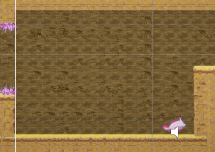
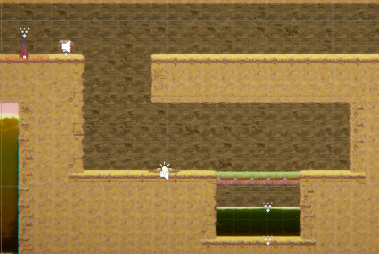
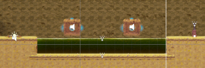
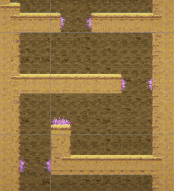
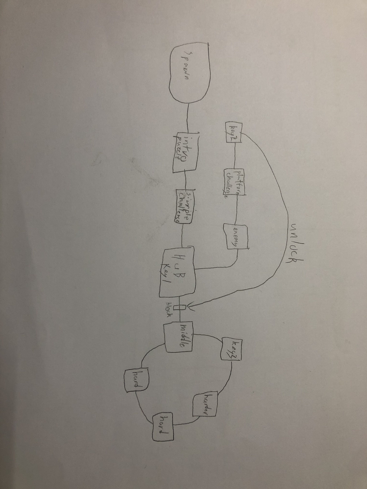
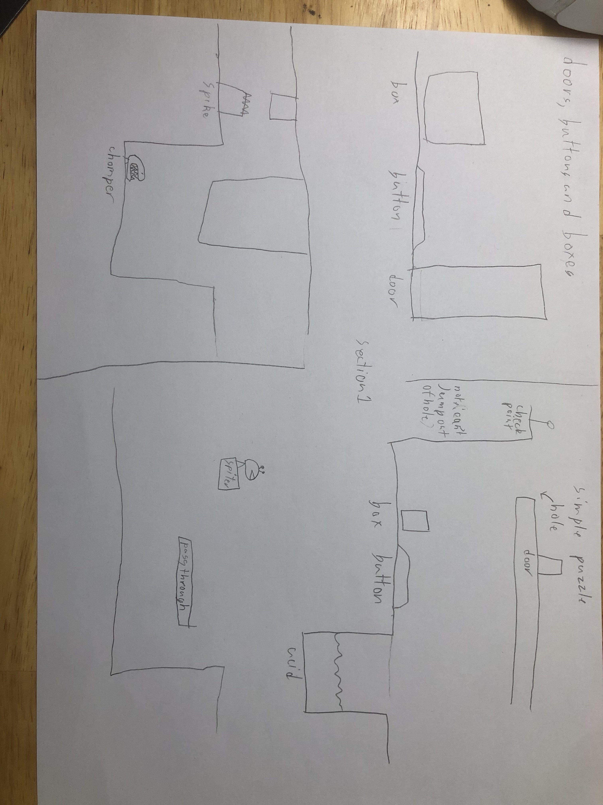
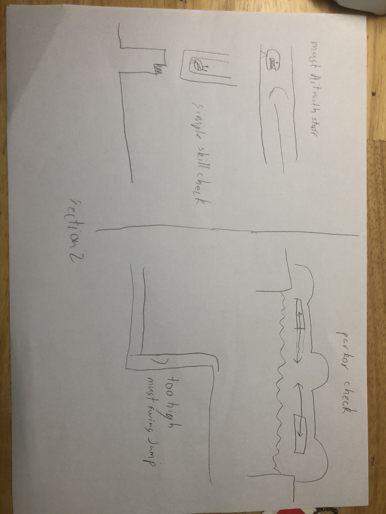
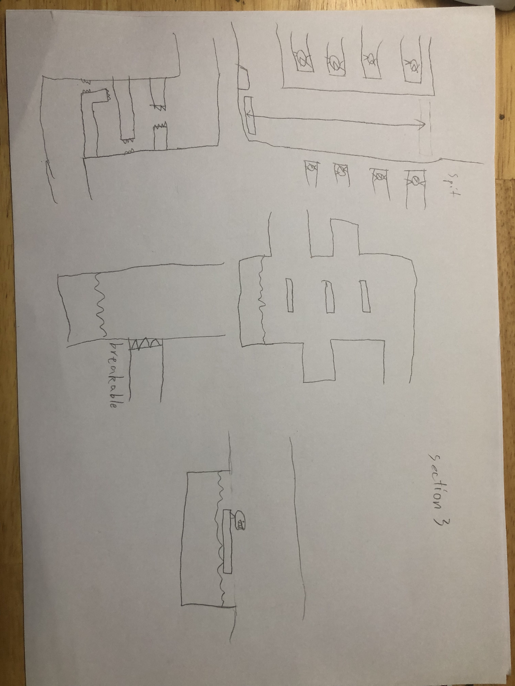

[](https://classroom.github.com/a/YyUO0xtt)
# COMP2150  - Level Design Document
### Name: Alexander Valent
### Student number: 47875038

```



```

## 1. Player Experience (~700 words)
Outline and justify how your level design facilitates the core player experience goals outlined in the assignment spec. Each section should be supported by specific examples and screenshots of your game encounters that highlight design choices made to facilitate that particular experience.

### 1.1. Discovery
at the begging of the game and during the first section i try to show off multiple mechanics at a time with a room showcaseing some of the interesting and notable interactions with the different part of the game and how they work together to create a large amount of possiblities, an example of this would be the puzzle with the acid that needs you to use the checkpoint to move on while also showing you that the acid doesn't kill and will send you back to the checkpoint with your progress saved. throught out the entire game experience it shows less new mechanics directly and starts trying to get the player to discover them on their own, for example with the lift and how it has you dodge the enemy projectiles and trying to figure out the best way to deal with it. 



### 1.2. Drama
through out the game you are introduced to more difficult challenges that have more major setbacks and require more of the players attention this creates a more engageing experenice with the game and player.



### 1.3. Challenge




### 1.4. Exploration
How does your level design facilitate autonomy and invite the player to explore? How do your aesthetic and layout choices create distinct and memorable spaces and/or places?

## 2. Core Gameplay (~400 words)
A section on Core Gameplay, where storyboards are used to outline how you introduce the player to each of the required gameplay elements in the first section of the game. Storyboards should follow the format provided in lectures.

### 2.1. Acid 
the acid not killing instantly was an important distinction i needed to make early while showing that it still dealt damage

### 2.2. Checkpoints
knowing what the checkpoints looked like would be important to keeping the players progression throughout the entire 

### 2.3. Passthrough Platforms :)


### 2.4. Health Pickups :)

### 2.5. Moving Platforms :)

### 2.6. Spikes :)

### 2.7. Chompers :)

### 2.8. Spitters :)

### 2.9. Keys :)

### 2.10. Weapon Pickup (Staff) :)

### 2.11. Weapon Pickup (Gun) :)

## 3. Spatiotemporal Design
A section on Spatiotemporal Design, which includes your molecule diagram and annotated level maps (one for each main section of your level). These diagrams may be made digitally or by hand, but must not be created from screenshots of your game. The annotated level maps should show the structure you intend to build, included game elements, and the path the player is expected to take through the level. Examples of these diagrams are included in the level design lectures.

No additional words are necessary for this section (any words should only be within your images/diagrams).
 
### 3.1. Molecule Diagram


### 3.2. Level Map – Section 1


### 3.3.	Level Map – Section 2


### 3.4.	Level Map – Section 3


## 4. Iterative Design (~400 words)
Reflect on how iterative design helped to improve your level. Additional prototypes and design artefacts should be included to demonstrate that you followed an iterative design process (e.g. pictures of paper prototypes, early grey-boxed maps, additional storyboards of later gameplay sequences, etc.). You can also use this section to justify design changes made in Unity after you drew your level design maps shown in section 3. 

You should conclude by highlighting a specific example of an encounter, or another aspect of your level design, that could be improved through further iterative design.

## Generative AI Use Acknowledgement

Use the below table to indicate any Generative AI or writing assistance tools used in creating your document. Please be honest and thorough in your reporting, as this will allow us to give you the marks you have earnt. Place any drafts or other evidence inside this repository. This form and related evidence do not count to your word count.
An example has been included. Please replace this with any actual tools, and add more as necessary.


### Tool Used: ChatGPT
**Nature of Use** Finding relevant design theory.

**Evidence Attached?** Screenshot of ChatGPT conversation included in the folder "GenAI" in this repo.

**Additional Notes:** I used ChatGPT to try and find some more relevant design theory that I could apply to my game. After googling them, however, I found most of them were inaccurate, and some didn't exist. One theory mentioned, however, was useful, and I've incorporated it into my work.

### Tool Used: Example
**Nature of Use** Example Text

**Evidence Attached?** Example Text

**Additional Notes:** Example Text


